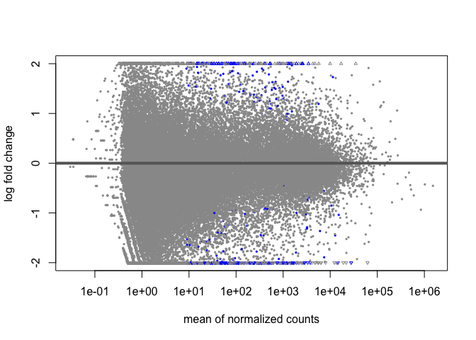
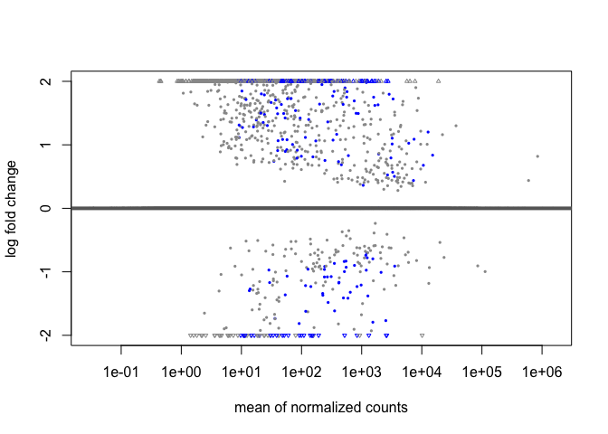
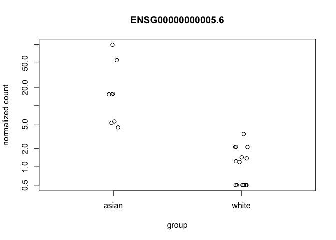
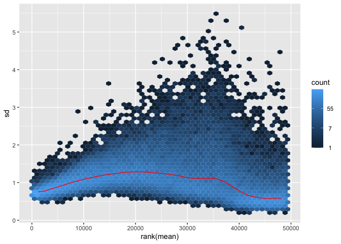
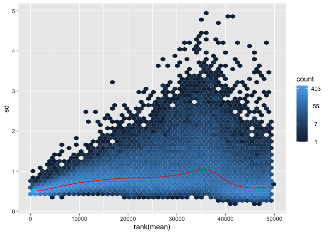
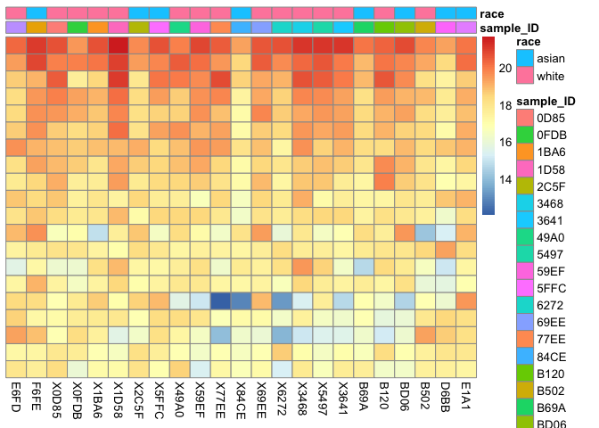
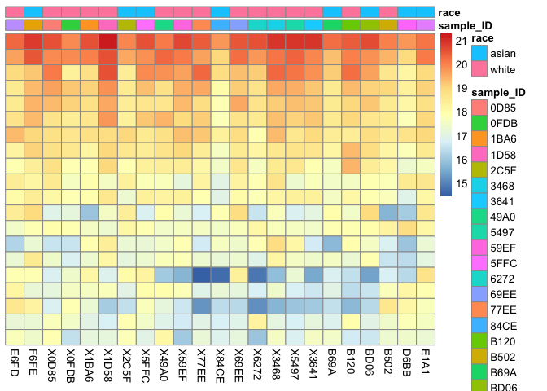
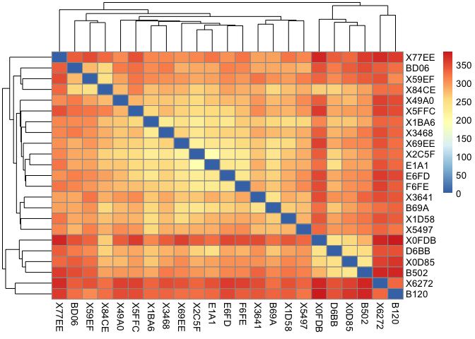
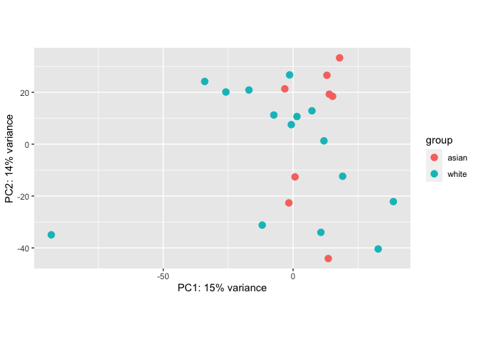

================
# Final Project Outline

Note: This is a makeup project which starts on Feb 10, 2023. The expected time of completion would be 1 month from the start, ending on March 9, 2023. There will be a checkpoint or a milestone discussion every Thursday during the period, through Google Calender invitation. The meeting time is subject to change upon negotiation in advance (either in person or online).

## Title
Differential Gene Expression in TCGA within Stage II gastric cancer between asian and white using DeSEQ2.

## Author
Linghao Zou (Loe)

## Supervisor
Dr. David Wesley Craig (USC)

## Contact
zoul@usc.edu

## Overview of the Project

In this project, I will identify differentially expressed genes between white vs. asians on Stomach Cancer Adenocarcomas and Adenocarcinomas. The analysis will be utilizing the package DeSEQ2 and following the specific [vignette and bioconductor package](http://bioconductor.org/packages/release/bioc/vignettes/DESeq2/inst/doc/DESeq2.html)(DESEQ)to explore the correlation and comparision between the two groups. Specifically, I will be using the TCGA cohort and identifying 205 star_counts open files for tumors that fit within my cohort with 144 whites and 46 asians. Within the analysis, I will be controlling the factors including gender, age and disease type inside gdc portal. 

**Modified on Feb, 2023: I have shrunk the sample size to the first 23 appearance, including 8 asians and 15 whites to save the analysis time. If the sample size is not big enough to show the clear correlation, please follow the "Part 1" section down below to expand the target group. All the 205 star_counts can be found in the repository.** 

## Data

The data is collected from [GDC Portal](https://portal.gdc.cancer.gov/repository). By examining the clinical data, there are 190 tumor samples (but 205 files in total, as some samples have relapses and thus two associated files), among which 144 are whites and 46 are asians (data is selected and shrunk as mentioned). The specific files are available under this repository ([click to view](https://github.com/Loe-zou/Final-Project/blob/main/clinical.tsv)).

*********

## Milestone 1 (done)

> Define the milestone based on initial view of the data.

**Check Point:** Feb 16 (done)

**Data Wrangling and Loading (Table and Sheets formed

**Due Date:** Feb 23 (done)

**Data fully loaded into vignette through DESeq2 steps (Star-Count section) ** Initial analysis through the vignette starts here.


## Milestone 2 (done, email sent)

> Define the milestone 2 which includes initial running of the entire vignette for feedback.

**Due Date:** March 2 (done, email sent for check)

**An initial completion of the vignette.** I will complete an entire first draft of the data analysis. Data will be loaded into the vignette (through star_count), marked with errors and bugs, to be discussed with the supervisor. 

## Deliverable

**Due Date:** March 9 (Data Wrangling and DESeq2 done on Mar 5, to-do: HUGO genes CSV upload)

A complete repository with clear documentation and description of the analysis with results will be delivered by the due date.

# Part 1 - Data Wrangling of the Raw (all in bash/unix)

## Data download and adjustment (Merged Counts)
Downloaded raw data from gdc portal, following the data selection for comparation as mentioned above under "Data", and the corresponding folder labeled "gdc_download_20221115_212727.200657" can be found in the local.

For each sample file inside the folder, extract the 3rd column (unstranded counts) and convert it into a txt file, which is named for the first 4 characters of the original file.
```{bash}
awk'{print$4}' sample_genes.tsv > sample_genes.txt
```
For instance,
```{bash}
awk'{print$4}' e6fd3732-7e90-46ec-82fc-d1dcb8849e67.rna_seq.augmented_star_gene_counts.tsv > E6FD.txt
```

Replace the header of each sample gene file to match the file name (23 samples selected in total for analysis)
 **Credited to EunkSung**
```
./replace_header.sh
```

Extract the gene_id and remove the 1st column from one of the sample files, for instance:

```
awk '{print $1}'e6fd3732-7e90-46ec-82fc-d1dcb8849e67.rna_seq.augmented_star_gene_counts.tsv > ID.txt
tail -n +2 ID.txt > newID.txt
```
Remove the row 2-4 (if printed, remove them in the folder):
```
awk '!/^N_*/' newID.txt > newID.txt
```

Paste the new gene_id（newID.txt) and each sample counts (txt) together to obtain the final_genes for package import
```
paste gene_id.txt E6FD.txt F6FE.txt 0D85.txt 0FDB.txt 1BA6.txt 1D58.txt 2C5F.txt 5FFC.txt 49A0.txt 59EF.txt 77EE.txt 84CE.txt 69EE.txt 6272.txt 3468.txt 5497.txt 3641.txt B69A.txt B120.txt BD06.txt B502.txt D6BB.txt E1A1.txt > final_genes.txt
```

## Generate Race Table (bash)

Follow the same logic from above, in bash, use awk to extract the column $16 from clinical.tsv > txt and $0 of each sample gene txt to paste them together to redirect into > race_table.csv and race_table.tsv (please find in the repository)

Extract the gene IDs from final_genes file and convert the row name into the first column name:
```
#Extract Sample_ID into a new table and convert the row into column

```
awk 'NR==1 {print; exit}' final_genes.txt > row_final.tsv
```
Change the row_final into first column including all gene/sample IDs using xargs:

```
xargs -n1 < row_final.tsv > column_final.tsv
```

Select the race column (white/asian) from the clinical table and extract the first 23 samples:
```
awk -F"\t" '{print $16} NR==23{exit}'clinical.tsv > race.tsv
```
Paste and re-direct them to the new race table:

```
paste column_final.tsv race.tsv > race_table.tsv
```

# Part 2 R Studio Data Import (Unit test Passila is skipped as the loaded dataset works fine along analysis process)

## Install packages

``` r
BiocManager::install("DeSeq2")
```

    ## Bioconductor version 3.16 (BiocManager 1.30.20), R 4.2.1 (2022-06-23)

    ## Installing package(s) 'DeSeq2'

    ## Warning: package 'DeSeq2' is not available for Bioconductor version '3.16'
    ## 
    ## A version of this package for your version of R might be available elsewhere,
    ## see the ideas at
    ## https://cran.r-project.org/doc/manuals/r-patched/R-admin.html#Installing-packages

    ## Warning: Perhaps you meant 'DESeq2' ?

    ## Old packages: 'mgcv', 'renv', 'rgeos'

``` r
BiocManager::install("dplyr")
```

    ## Bioconductor version 3.16 (BiocManager 1.30.20), R 4.2.1 (2022-06-23)

    ## Warning: package(s) not installed when version(s) same as or greater than current; use
    ##   `force = TRUE` to re-install: 'dplyr'

    ## Old packages: 'mgcv', 'renv', 'rgeos'

``` r
BiocManager::install("apeglm")
```

    ## Bioconductor version 3.16 (BiocManager 1.30.20), R 4.2.1 (2022-06-23)

    ## Warning: package(s) not installed when version(s) same as or greater than current; use
    ##   `force = TRUE` to re-install: 'apeglm'

    ## Old packages: 'mgcv', 'renv', 'rgeos'

``` r
BiocManager::install("vsn")
```

    ## Bioconductor version 3.16 (BiocManager 1.30.20), R 4.2.1 (2022-06-23)

    ## Warning: package(s) not installed when version(s) same as or greater than current; use
    ##   `force = TRUE` to re-install: 'vsn'

    ## Old packages: 'mgcv', 'renv', 'rgeos'

``` r
BiocManager::install("pheatmap")
```

    ## Bioconductor version 3.16 (BiocManager 1.30.20), R 4.2.1 (2022-06-23)

    ## Warning: package(s) not installed when version(s) same as or greater than current; use
    ##   `force = TRUE` to re-install: 'pheatmap'

    ## Old packages: 'mgcv', 'renv', 'rgeos'

## Library loading

``` r
library(DESeq2)
```

    ## Warning: package 'DESeq2' was built under R version 4.2.2

    ## Loading required package: S4Vectors

    ## Warning: package 'S4Vectors' was built under R version 4.2.2

    ## Loading required package: stats4

    ## Loading required package: BiocGenerics

    ## 
    ## Attaching package: 'BiocGenerics'

    ## The following objects are masked from 'package:stats':
    ## 
    ##     IQR, mad, sd, var, xtabs

    ## The following objects are masked from 'package:base':
    ## 
    ##     anyDuplicated, aperm, append, as.data.frame, basename, cbind,
    ##     colnames, dirname, do.call, duplicated, eval, evalq, Filter, Find,
    ##     get, grep, grepl, intersect, is.unsorted, lapply, Map, mapply,
    ##     match, mget, order, paste, pmax, pmax.int, pmin, pmin.int,
    ##     Position, rank, rbind, Reduce, rownames, sapply, setdiff, sort,
    ##     table, tapply, union, unique, unsplit, which.max, which.min

    ## 
    ## Attaching package: 'S4Vectors'

    ## The following objects are masked from 'package:base':
    ## 
    ##     expand.grid, I, unname

    ## Loading required package: IRanges

    ## Loading required package: GenomicRanges

    ## Warning: package 'GenomicRanges' was built under R version 4.2.2

    ## Loading required package: GenomeInfoDb

    ## Warning: package 'GenomeInfoDb' was built under R version 4.2.2

    ## Loading required package: SummarizedExperiment

    ## Loading required package: MatrixGenerics

    ## Loading required package: matrixStats

    ## 
    ## Attaching package: 'MatrixGenerics'

    ## The following objects are masked from 'package:matrixStats':
    ## 
    ##     colAlls, colAnyNAs, colAnys, colAvgsPerRowSet, colCollapse,
    ##     colCounts, colCummaxs, colCummins, colCumprods, colCumsums,
    ##     colDiffs, colIQRDiffs, colIQRs, colLogSumExps, colMadDiffs,
    ##     colMads, colMaxs, colMeans2, colMedians, colMins, colOrderStats,
    ##     colProds, colQuantiles, colRanges, colRanks, colSdDiffs, colSds,
    ##     colSums2, colTabulates, colVarDiffs, colVars, colWeightedMads,
    ##     colWeightedMeans, colWeightedMedians, colWeightedSds,
    ##     colWeightedVars, rowAlls, rowAnyNAs, rowAnys, rowAvgsPerColSet,
    ##     rowCollapse, rowCounts, rowCummaxs, rowCummins, rowCumprods,
    ##     rowCumsums, rowDiffs, rowIQRDiffs, rowIQRs, rowLogSumExps,
    ##     rowMadDiffs, rowMads, rowMaxs, rowMeans2, rowMedians, rowMins,
    ##     rowOrderStats, rowProds, rowQuantiles, rowRanges, rowRanks,
    ##     rowSdDiffs, rowSds, rowSums2, rowTabulates, rowVarDiffs, rowVars,
    ##     rowWeightedMads, rowWeightedMeans, rowWeightedMedians,
    ##     rowWeightedSds, rowWeightedVars

    ## Loading required package: Biobase

    ## Welcome to Bioconductor
    ## 
    ##     Vignettes contain introductory material; view with
    ##     'browseVignettes()'. To cite Bioconductor, see
    ##     'citation("Biobase")', and for packages 'citation("pkgname")'.

    ## 
    ## Attaching package: 'Biobase'

    ## The following object is masked from 'package:MatrixGenerics':
    ## 
    ##     rowMedians

    ## The following objects are masked from 'package:matrixStats':
    ## 
    ##     anyMissing, rowMedians

``` r
library(dplyr)
```

    ## 
    ## Attaching package: 'dplyr'

    ## The following object is masked from 'package:Biobase':
    ## 
    ##     combine

    ## The following object is masked from 'package:matrixStats':
    ## 
    ##     count

    ## The following objects are masked from 'package:GenomicRanges':
    ## 
    ##     intersect, setdiff, union

    ## The following object is masked from 'package:GenomeInfoDb':
    ## 
    ##     intersect

    ## The following objects are masked from 'package:IRanges':
    ## 
    ##     collapse, desc, intersect, setdiff, slice, union

    ## The following objects are masked from 'package:S4Vectors':
    ## 
    ##     first, intersect, rename, setdiff, setequal, union

    ## The following objects are masked from 'package:BiocGenerics':
    ## 
    ##     combine, intersect, setdiff, union

    ## The following objects are masked from 'package:stats':
    ## 
    ##     filter, lag

    ## The following objects are masked from 'package:base':
    ## 
    ##     intersect, setdiff, setequal, union

``` r
library(tibble)
library(tidyverse)
```

    ## ── Attaching core tidyverse packages ──────────────────────── tidyverse 2.0.0 ──
    ## ✔ forcats   1.0.0     ✔ readr     2.1.4
    ## ✔ ggplot2   3.4.1     ✔ stringr   1.5.0
    ## ✔ lubridate 1.9.2     ✔ tidyr     1.3.0
    ## ✔ purrr     1.0.1

    ## ── Conflicts ────────────────────────────────────────── tidyverse_conflicts() ──
    ## ✖ lubridate::%within%() masks IRanges::%within%()
    ## ✖ dplyr::collapse()     masks IRanges::collapse()
    ## ✖ dplyr::combine()      masks Biobase::combine(), BiocGenerics::combine()
    ## ✖ dplyr::count()        masks matrixStats::count()
    ## ✖ dplyr::desc()         masks IRanges::desc()
    ## ✖ tidyr::expand()       masks S4Vectors::expand()
    ## ✖ dplyr::filter()       masks stats::filter()
    ## ✖ dplyr::first()        masks S4Vectors::first()
    ## ✖ dplyr::lag()          masks stats::lag()
    ## ✖ ggplot2::Position()   masks BiocGenerics::Position(), base::Position()
    ## ✖ purrr::reduce()       masks GenomicRanges::reduce(), IRanges::reduce()
    ## ✖ dplyr::rename()       masks S4Vectors::rename()
    ## ✖ lubridate::second()   masks S4Vectors::second()
    ## ✖ lubridate::second<-() masks S4Vectors::second<-()
    ## ✖ dplyr::slice()        masks IRanges::slice()
    ## ℹ Use the ]8;;http://conflicted.r-lib.org/conflicted package]8;; to force all conflicts to become errors

``` r
library(apeglm)
library(ggplot2)
library(vsn)
library(pheatmap)
library(ReportingTools)
```

    ## Loading required package: knitr
    ## 
    ## Registered S3 method overwritten by 'GGally':
    ##   method from   
    ##   +.gg   ggplot2

## Set up working directory and read the count pre-made into count_matrix, remove the first 4 lines to fit

``` r
setwd('~/Desktop/510makeup/')

count_matrix <- read.delim('~/Desktop/510makeup/raw/final_genes.txt')

count_matrix <- head(count_matrix, -4)
```

## Change column 1 to row name and so does sample table to fit into the count_matrix

- Data type is changed into factor as well
- DESeq2 dataset is generated following the vignette

``` r
row.names(count_matrix) <- count_matrix$gene_id
count_matrix <- count_matrix[-c(1)]

sampletable <- read_tsv('~/Desktop/510makeup/raw/race_table.tsv')
```

    ## Rows: 23 Columns: 2
    ## ── Column specification ────────────────────────────────────────────────────────
    ## Delimiter: "\t"
    ## chr (2): sample_ID, race
    ## 
    ## ℹ Use `spec()` to retrieve the full column specification for this data.
    ## ℹ Specify the column types or set `show_col_types = FALSE` to quiet this message.

``` r
row.names(sampletable) <- sampletable$sample_ID
```

    ## Warning: Setting row names on a tibble is deprecated.

``` r
sampletable$race <- as.factor(sampletable$race)

DES_dataset <- DESeqDataSetFromMatrix(countData = count_matrix,
                                      colData = sampletable,
                                      design = ~ race)
```

## Filtering and Standard Differential Expression Analysis

``` r
#pre-filtering
nrow(DES_dataset)
```

    ## [1] 60656

``` r
#keep <- rowSums(counts(dds)) >= 10
#dds <- dds[keep,]
## Void test lines

DES_dataset <- DES_dataset[rowSums(counts(DES_dataset)) > 10, ]

# Number of gene after pre-filtering (genes longer than 10 reads have been filtered out, and let's check the filtered data load)
nrow(DES_dataset)
```

    ## [1] 49354

``` r
DES_dataset <- DESeq(DES_dataset)
```

    ## estimating size factors

    ## estimating dispersions

    ## gene-wise dispersion estimates

    ## mean-dispersion relationship

    ## final dispersion estimates

    ## fitting model and testing

    ## -- replacing outliers and refitting for 4261 genes
    ## -- DESeq argument 'minReplicatesForReplace' = 7 
    ## -- original counts are preserved in counts(dds)

    ## estimating dispersions

    ## fitting model and testing

## Now print new data set to a result variable and peak the head

``` r
res <- results(DES_dataset)
head(res)
```

    ## log2 fold change (MLE): race white vs asian 
    ## Wald test p-value: race white vs asian 
    ## DataFrame with 6 rows and 6 columns
    ##                      baseMean log2FoldChange     lfcSE      stat      pvalue
    ##                     <numeric>      <numeric> <numeric> <numeric>   <numeric>
    ## ENSG00000000003.15 3677.53281      -0.722513  0.488345 -1.479513 1.39003e-01
    ## ENSG00000000005.6     9.71369      -5.172131  0.762090 -6.786771 1.14671e-11
    ## ENSG00000000419.13 3121.57711       0.484119  0.205231  2.358897 1.83293e-02
    ## ENSG00000000457.14  922.96450       0.208729  0.196649  1.061428 2.88495e-01
    ## ENSG00000000460.17  620.94701       0.221609  0.289542  0.765378 4.44047e-01
    ## ENSG00000000938.13  577.54322      -1.067189  0.395132 -2.700843 6.91639e-03
    ##                           padj
    ##                      <numeric>
    ## ENSG00000000003.15 6.02450e-01
    ## ENSG00000000005.6  2.91585e-07
    ## ENSG00000000419.13 3.00696e-01
    ## ENSG00000000457.14 7.46333e-01
    ## ENSG00000000460.17 8.41930e-01
    ## ENSG00000000938.13 2.01566e-01

- The results look good, here is an illustration on the 6 features
  (credited to bigyambat):
  - Base Mean = Average of the normalized count values
  - log2(FoldChange) = Change in gene expression between male and female
  - lfcSE = Standard Error of the log2 fold change values
  - stat = Wald’s test to determine the weighted distance between gene
    expression
  - pvalue = Hypothesis test to tell whether expression difference is
    significant
  - padj = Adjusted P values based on the Benjamini-Hochberg adjustment

\*Specify the coefficient or contrast we want to build a results table
for, using either of the following equivalent commands:

``` r
res <- results(DES_dataset, contrast=c("race","asian","white"))
```

## Log fold change shrinkage for visualization and ranking

LfcShrink adds a shrunken log2fold change and standard error results
table from DESeq.apeglm is used for generating best shrinkage results.

``` r
resultsNames(DES_dataset)
```

    ## [1] "Intercept"           "race_white_vs_asian"

``` r
resLFC <- lfcShrink(DES_dataset, coef="race_white_vs_asian", type="apeglm")
```

    ## using 'apeglm' for LFC shrinkage. If used in published research, please cite:
    ##     Zhu, A., Ibrahim, J.G., Love, M.I. (2018) Heavy-tailed prior distributions for
    ##     sequence count data: removing the noise and preserving large differences.
    ##     Bioinformatics. https://doi.org/10.1093/bioinformatics/bty895

``` r
resLFC
```

    ## log2 fold change (MAP): race white vs asian 
    ## Wald test p-value: race white vs asian 
    ## DataFrame with 49354 rows and 5 columns
    ##                      baseMean log2FoldChange      lfcSE      pvalue        padj
    ##                     <numeric>      <numeric>  <numeric>   <numeric>   <numeric>
    ## ENSG00000000003.15 3677.53281   -3.32891e-06 0.00144269 1.39003e-01 6.02450e-01
    ## ENSG00000000005.6     9.71369   -4.93838e+00 0.76437682 1.14671e-11 2.91585e-07
    ## ENSG00000000419.13 3121.57711    1.16746e-05 0.00144269 1.83293e-02 3.00696e-01
    ## ENSG00000000457.14  922.96450    5.50915e-06 0.00144266 2.88495e-01 7.46333e-01
    ## ENSG00000000460.17  620.94701    5.15354e-06 0.00144268 4.44047e-01 8.41930e-01
    ## ...                       ...            ...        ...         ...         ...
    ## ENSG00000288660.1   68.018094    1.38339e-07 0.00144269  0.66719017    0.923584
    ## ENSG00000288662.1    3.291373    2.57778e-06 0.00144269  0.04119310          NA
    ## ENSG00000288663.1   40.485113    7.93165e-06 0.00144270  0.00645508    0.195882
    ## ENSG00000288667.1    3.650157    1.16770e-06 0.00144269  0.33861921          NA
    ## ENSG00000288669.1    0.537648   -3.66298e-07 0.00144269  0.65789964          NA

Citation for using apeglm: Zhu, A., Ibrahim, J.G., Love, M.I. (2018)
Heavy-tailed prior distributions for sequence count data: removing the
noise and preserving large differences. Bioinformatics.
<https://doi.org/10.1093/bioinformatics/bty895>

## P-Values and Adjusted P-Values

First, order the result table by its smallest p-value:

``` r
resOrdered <- res[order(res$pvalue),]
```

Summarize basic tallies:

``` r
summary(res)
```

    ## 
    ## out of 49344 with nonzero total read count
    ## adjusted p-value < 0.1
    ## LFC > 0 (up)       : 137, 0.28%
    ## LFC < 0 (down)     : 185, 0.37%
    ## outliers [1]       : 0, 0%
    ## low counts [2]     : 23926, 48%
    ## (mean count < 9)
    ## [1] see 'cooksCutoff' argument of ?results
    ## [2] see 'independentFiltering' argument of ?results

P-Values display(\< 0.1)

``` r
sum(res$padj < 0.1, na.rm=TRUE)
```

    ## [1] 322

## MA Plots (shows log2fold difference, normalized counts)

Plot for all genes after filtering

``` r
plotMA(res, ylim=c(-2,2))
```

<!-- --> Shrunken Genes
Plot (log2 fold changes)

``` r
plotMA(resLFC, ylim=c(-2,2))
```

<!-- --> \## More on
Plot Counts Variable of interest, in the case, indicated as ‘race’

``` r
plotCounts(DES_dataset, gene = which.min(res$padj), intgroup = "race")
```

<!-- --> \## Data
transformations and visualization: Extracting transformed values through
VST(vsd) and RLT(rld)

Prepare for a long execution time… Sys.time to see how long it might
take

``` r
# code chunk
start_time <- system.time({
  # R code to be executed
  x <- rnorm(1000000)
  mean(x)
})
end_time <- system.time(Sys.time())

# calculate the execution time
execution_time <- end_time - start_time
print(execution_time)
```

    ##    user  system elapsed 
    ##  -0.071   0.000  -0.071

Extracting transformed values through VST(vsd) and RLT(rld) - stuck…

``` r
vsd <- vst(DES_dataset, blind = FALSE)
rld <- rlog(DES_dataset, blind=FALSE)
```

``` r
head(assay(vsd), 5)
```

    ##                         E6FD      F6FE     X0D85     X0FDB     X1BA6     X1D58
    ## ENSG00000000003.15 11.153247  7.919884 12.366573 10.744922 10.623558 11.310356
    ## ENSG00000000005.6   2.746429  4.404532  3.071796  2.752653  2.422136  2.500566
    ## ENSG00000000419.13 11.187258 11.049879 11.979118 11.346247 11.353577 12.299934
    ## ENSG00000000457.14  9.528856  9.362813  9.900293 10.166570  9.727631 10.452843
    ## ENSG00000000460.17  9.008398  8.806754  9.281631 10.327038  9.118321  8.996515
    ##                        X2C5F     X5FFC     X49A0     X59EF     X77EE     X84CE
    ## ENSG00000000003.15 11.530651 14.067014 12.477556 10.620574 12.510528 12.390435
    ## ENSG00000000005.6   3.431689  3.255723  2.748766  1.780709  1.780709  4.405296
    ## ENSG00000000419.13 10.775568 11.914312 11.774721 11.355192 11.920220 11.355540
    ## ENSG00000000457.14  9.733854  9.075130  9.860282  9.696672  9.775412  9.912941
    ## ENSG00000000460.17  9.268493  8.937881  8.255224  7.913889  9.779328  9.028738
    ##                        X69EE     X6272     X3468     X5497     X3641      B69A
    ## ENSG00000000003.15 10.664656 11.303084 11.170418 12.550784 11.487524 11.847179
    ## ENSG00000000005.6   1.780709  2.441729  1.780709  2.521682  1.780709  3.391183
    ## ENSG00000000419.13 11.384118 11.636171 11.420694 12.585558 11.570725 11.333492
    ## ENSG00000000457.14  9.985596  9.921695  9.267250  9.192205 10.624020 10.237651
    ## ENSG00000000460.17  8.993925  9.867177  9.057977  9.370389 10.411489  8.913802
    ##                         B120      BD06      B502      D6BB      E1A1
    ## ENSG00000000003.15  8.777532 11.522390 11.462930 12.469669 10.660072
    ## ENSG00000000005.6   1.780709  6.723482  1.780709  5.946071  4.422930
    ## ENSG00000000419.13 11.215705 11.219319 12.367261 11.367147 10.904229
    ## ENSG00000000457.14 10.199885  9.282397  9.914399 10.215709  9.492719
    ## ENSG00000000460.17  8.265112  8.618523  9.412798  9.920736  9.261359

## Variance Plots (Transformation)

``` r
ntd <- normTransform(DES_dataset)
meanSdPlot(assay(ntd))
```

    ## Found more than one class "simpleUnit" in cache; using the first, from namespace 'ggbio'

    ## Also defined by 'hexbin'

<!-- --> VST measurement

``` r
meanSdPlot(assay(vsd))
```

<!-- --> \## Sample
clustering and visualization (heatmap for further quality assessment)

1.  Normal Transformation Heatmap

``` r
library("pheatmap")
select <- order(rowMeans(counts(DES_dataset,normalized=TRUE)),
                decreasing=TRUE)[1:20]
df <- as.data.frame(colData(DES_dataset)[,c("sample_ID","race")])
pheatmap(assay(ntd)[select,], cluster_rows=FALSE, show_rownames=FALSE,
         cluster_cols=FALSE, annotation_col=df)
```

    ## Found more than one class "unit" in cache; using the first, from namespace 'ggbio'

    ## Also defined by 'hexbin'

    ## Found more than one class "simpleUnit" in cache; using the first, from namespace 'ggbio'

    ## Also defined by 'hexbin'

<!-- -->

2.  Variance Stablizing Transformation Heatmap

``` r
pheatmap(assay(vsd)[select,], cluster_rows=FALSE, show_rownames=FALSE, cluster_cols=FALSE, annotation_col=df)
```

<!-- --> 3.Regularized
log Transformation Heatmap

``` r
pheatmap(assay(rld)[select,], cluster_rows=FALSE, show_rownames=FALSE,
         cluster_cols=FALSE, annotation_col=df)
```

<!-- --> \## Sample to
Sample Distances

``` r
sampleDists <- dist(t(assay(vsd)))
DistMatrix <- as.matrix(sampleDists)
pheatmap(DistMatrix)
```

<!-- --> \## Principal
Componant Analysis

Plot:

``` r
plotPCA(vsd, intgroup="race")
```

<!-- --> The plotshows a
14-15% variance (2 PCs) between the two groups
